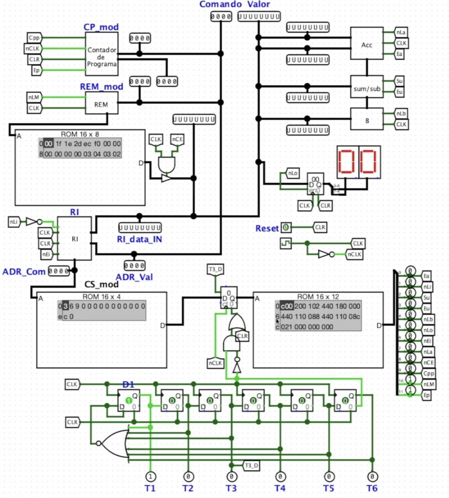

# SAP-1 Logisim-Evolution Project

An implementation of the **Simple-As-Possible computer (SAP-1)** built in Logisim-evolution 3.8.0. This project reproduces the 8-bit architecture popularized by Malvino's *Digital Computer Electronics*, using Logisim's digital logic simulator so you can inspect, modify, and extend the design visually.

## Prerequisites
- Logisim-evolution 3.8.0 or newer. A direct download link is stored in `docs/logisim-evolution-download.txt` and the official release page is [available on GitHub](https://github.com/logisim-evolution/logisim-evolution/releases).

## Getting Started
1. Launch Logisim-evolution.
2. Open `circuits/sap1.circ`.
3. Load or edit the ROM contents to experiment with instruction sequences.
4. Use the Control and Execution panels to single-step or run programs while monitoring the registers and bus.

### macOS Gatekeeper Warning

If macOS Gatekeeper flags the Logisim-evolution app, go to **System Preferences → Privacy & Security** and click **Open Anyway** to allow the application to run.

## Repository Layout
- `circuits/sap1.circ` – main Logisim-evolution project containing the SAP-1 schematic, wiring, and control logic.
- `docs/images/` – high-resolution references that document default ROM contents, program examples, and macOS Gatekeeper instructions.
- `docs/logisim-evolution-download.txt` – direct URL for the Logisim-evolution 3.8.0 JAR used to develop and test this circuit.

## Reference Material

### Instruction Set

The SAP-1 supports a minimal instruction set. The address routine table below shows the mapping between opcodes and their corresponding routines:

### Control ROM

The control unit uses a ROM to generate micro-instructions for each machine cycle. The table below details the contents of the control ROM:

### Example Program

The following example demonstrates a program that computes `2 + 3 + 4 - 1 = 8`:

## Contributing
Feel free to fork the project, adapt the ROM contents, or upgrade the design (e.g., additional instructions, memory, or I/O). Pull requests are welcome—just keep the documentation in sync with any new features.

## License
This project is licensed under the terms of the MIT License. See `LICENSE` for details.
